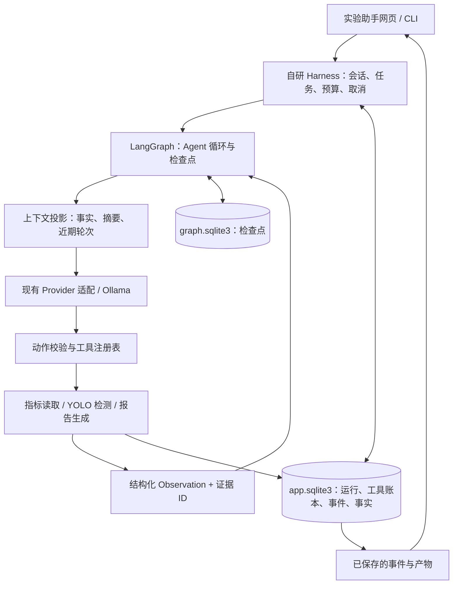

# 历史方案：华小牛·本地视觉实验助手

研究日期：2026-10-08。状态：历史设计，未实施。用户已明确要求自动化全部科研流程，本稿只覆盖已有实验的读取、检测和报告，范围不足，已停止作为实施依据。现行唯一主计划为 [全流程自动科研 Harness](harness-plan.md)。

这里的术语是 **Harness**。它负责把模型、工具、会话、任务状态、上下文和恢复机制组织成可运行的应用。

**当时的设计：参考 Pi 的分层，借鉴 Deep Agents 的任务清单与上下文管理，采用 OpenHands 的动作—结果契约，以 LangGraph 作为唯一执行引擎。** 以下保留历史取舍，不能代表现行全流程目标。

## 1. 为什么适合这次二面

PDF 第 3 页要求“参考 pi agent 的架构，搭建自己的 Harness”，允许结合专业和兴趣；自动科研是参考例子。此前已经完成的 Ollama、YOLO 训练和网页正好可以作为这个 Harness 的真实执行环境。

主任务：

> 读取这次训练结果，用公交车图片验证模型，说明结果的局限，生成一份带证据的实验报告。

运行后应看到任务清单、真实工具调用、标注图、训练指标和报告。服务中断后，能够恢复待完成步骤，复用已经保存的结果。

| 二面要求 | 本方案怎样体现 | 当前状态 |
| --- | --- | --- |
| 参考 Pi 架构搭建自己的 Harness | 模型、执行循环、会话、上下文、展示分层；自定义领域工具和运行协议 | 待实现 |
| 本地大模型与智能体 | 复用 Ollama / qwen2.5:7b，由模型选择注册工具 | 已有基础调用；新综合任务待验证 |
| API 接入应用 | FastAPI 增加实验助手接口，CLI 与网页共用 Harness | 待实现 |
| Ultralytics 训练、推理与应用 | 读取已有训练证据，调用真实 YOLO 检测；已有实时页继续承担实时展示 | 训练、推理已有；新工具接入待实现 |
| 创意作品 | 视觉实验助手本身是工具作品，并与现有文字冒险共存 | 新作品待实现 |
| 日志、README、Git、AI 使用说明 | 保存可导出的运行轨迹、设计取舍、验证记录；逐阶段同步工程文档 | 基础已有；新增证据待产生 |

## 2. 网上找到的三个方案

选择依据是官方架构和源码中可核查的能力，以及与题目、现有项目的对应关系。以下为本次调研结论，适用性评价是针对本项目的判断。

| 方案 | 官方可核查的能力 | 借鉴到本项目 | 本项目的取舍 |
| --- | --- | --- | --- |
| **Pi** | 模型访问与 Agent 核心分层；应用消息转换成模型消息；工具及消息事件；新 `pi-durable` 提供持久化 Harness | 清晰分层、上下文投影、事件生命周期、先保存再显示成功 | 用 Python 实现对应边界；`pi-durable` 官方标为实验性，首版借鉴设计 |
| **Deep Agents / LangGraph** | Deep Agents 提供上下文管理、结果外置等能力；任务清单当前需显式开启；底层 LangGraph 提供状态与检查点 | 结构化任务清单、大结果只送摘要和引用、检查点恢复 | 采用底层 LangGraph；本项目只注册少量领域工具，按需实现上层能力 |
| **OpenHands Software Agent SDK** | 类型化 Action、Observation、Executor；事件转成模型消息；Conversation 保存和恢复 | 严格区分动作请求与实际结果，保存工具输入、输出、错误、产物和运行状态 | 保留契约设计；当前 SDK 源码要求 Python ≥3.12，现有环境为 3.11 |

Pi 的 Agent 核心文档定义了上下文转换、事件流和工具执行模式；新增 durable 包明确提示 API 为实验性。[Pi Agent 文档](https://github.com/earendil-works/pi/blob/1cedd32724abfcb0915f76cc61b6827e2c16dbad/packages/agent/README.md)、[Pi durable 文档](https://github.com/earendil-works/pi/blob/1cedd32724abfcb0915f76cc61b6827e2c16dbad/packages/durable/README.md)。

Deep Agents 的分层是 Harness → LangChain Agent → LangGraph Runtime；当前官方说明中任务规划通过 `TodoListMiddleware` 显式开启，支持摘要和长结果外置。这些能力在本方案中分别落为任务状态和产物引用。[官方架构](https://github.com/langchain-ai/deepagents/blob/caaa7e7c12d214afa5cf0a1afed8eb6232aa6f7b/libs/ARCHITECTURE.md)、[官方能力说明](https://docs.langchain.com/oss/python/deepagents/overview)。

OpenHands 工具层使用 `Action → Observation` 输入输出契约，执行与会话层分开；其持久化指南保存事件、状态及工具输出。[工具架构](https://docs.openhands.dev/sdk/arch/tool-system)、[事件架构](https://docs.openhands.dev/sdk/arch/events)、[会话持久化](https://docs.openhands.dev/sdk/guides/convo-persistence)。Python 版本要求核对到本次源码快照。[SDK 项目配置](https://github.com/OpenHands/software-agent-sdk/blob/69e26889401fe69157fff536e6a69049e6644cb3/openhands-sdk/pyproject.toml)。

### 调研快照

| 项目 | 本次通过 `git ls-remote … HEAD` 核对的提交 |
| --- | --- |
| Pi | `1cedd32724abfcb0915f76cc61b6827e2c16dbad` |
| Deep Agents | `caaa7e7c12d214afa5cf0a1afed8eb6232aa6f7b` |
| OpenHands SDK | `69e26889401fe69157fff536e6a69049e6644cb3` |

提交快照用于固定参考资料；不把主分支项目版本号当作已安装或已验证的发布版本。官方网页可能继续更新，实施时重新核对接口并锁定依赖。

## 3. 新版比旧计划具体在哪里

| 旧计划 | 新版决定 | 原因 |
| --- | --- | --- |
| 主要自行编写循环与恢复基础设施 | LangGraph 负责节点调度和检查点，项目负责领域 Harness | 把实现精力放在真实工具、状态和证据链 |
| 通用的指标读取、检测和笔记 | 一个完整的视觉实验任务，生成结构化实验报告 | 面试现场能从输入一直演示到可核查产物 |
| 有工具事件，规划尚不具体 | 任务清单由模型提出，完成状态由执行结果确认 | 模型说“完成”不能让任务直接变绿 |
| 用同一个 `call_id` 防重 | 持久化执行 ID、业务幂等键、工具账本与报告导出队列 | 覆盖检查点与文件写入之间的中断窗口 |
| 长会话统一摘要 | 原始记录、事实表、模型上下文分别管理 | 压缩时保留真实指标和产物引用 |

首版保持单模型、顺序执行、少量工具和一个 FastAPI 服务。领域会话、预算、工具契约、证据核查和网页是“自己的 Harness”；LangGraph 承担通用运行机制。

## 4. 架构与技术选型



技术栈：Python 3.11、FastAPI、现有 httpx Provider、Ollama、Ultralytics、原生网页；新增直接依赖为 `langgraph` 和 `langgraph-checkpoint-sqlite`，异步调用使用 `AsyncSqliteSaver`。这是推荐选型，尚未安装或完成兼容性验证。当前 LangGraph 源码声明 Python ≥3.10，SQLite 检查点官方定位适合本地工作流；依赖解析和现有回归通过后再锁版本。[LangGraph 项目配置](https://github.com/langchain-ai/langgraph/blob/main/libs/langgraph/pyproject.toml)、[检查点指南](https://docs.langchain.com/oss/python/langgraph/checkpointers)。

新增代码集中在 `src/agent/harness/`：

| 模块 | 责任 |
| --- | --- |
| `service.py` | 新建运行、会话锁、取消、恢复、预算及 API 对接 |
| `graph.py` | 上下文 → 模型决策 → 一次工具执行 → 观察 → 下一轮 |
| `provider.py` | 复用并适配现有模型请求，支持异步取消和结构化结果 |
| `context.py` | 把应用状态转换成完整、预算内的模型消息 |
| `contracts.py` | Action、Observation、事件、任务、产物的数据契约 |
| `store.py` | 应用 SQLite 事务、执行账本、事实和事件查询 |
| `tools.py` | 领域工具注册、校验、执行、结果与报告导出 |

网页路由位于 `src/web/harness_routes.py`，新增独立实验助手页面。现有游戏和实时检测入口沿用原实现；共享 YOLO 使用资源锁协调，已有实时检测占用 GPU 时排队或返回明确忙碌状态。

## 5. 第一版的五个工具

| 工具 | 模型可提交的输入 | 返回的真实结果 | 副作用与约束 |
| --- | --- | --- | --- |
| `read_training_result` | `experiment_id` | 最佳验证与最后一轮指标、参数、样本数、来源标签、权重哈希、证据 ID | 只读白名单证据；哈希不符时标记历史指标，禁止套给当前权重 |
| `detect_image` | `image_id`、`confidence` | 类别、数量、置信度、坐标、实际设备、耗时、权重哈希、标注图 ID | 对已登记图片真实推理；同配置恢复时可复用已保存结果 |
| `read_artifact_summary` | `artifact_id`、允许的字段 | 产物摘要或分页明细 | 只读取本会话或允许共享的证据，响应有大小限制 |
| `update_task_board` | 任务描述、依赖和关联证据 ID | 经验证的任务清单 | 模型能提出/调整任务；执行器核查依赖和工具成功记录后才能确认完成 |
| `save_experiment_report` | 证据 ID 列表、带证据引用的分析条目 | 报告 ID、结构化正文、导出状态 | 事实字段由真实结果填入；报告及防重记录在同一 SQLite 事务内保存 |

上传图片由 API 解码、校验格式/字节数/像素数，分配 `image_id`。模型只使用 ID，路径由服务解析到受控目录。报告只导出到本项目运行产物目录。

YOLO 提供视觉事实；文本模型解释结构化检测结果。任务清单和任务依据属于可展示的工作计划，界面展示实际调用、结果与简短说明。

### 输出契约示例

```json
{
  "action_id": "本项目持久化分配的执行ID",
  "tool": "detect_image",
  "ok": true,
  "data": {"detections": [], "weights_sha256": "实际哈希"},
  "artifact_ids": ["标注图ID", "原始结果ID"],
  "error": null,
  "duration_ms": 1234
}
```

以上是格式示例，不是本次运行证据。失败时必须 `ok=false` 并给出错误类型；零检测结果可以成功返回空数组。

## 6. 保存、恢复与防重复执行

**图检查点与工具副作用需要分别处理。** LangGraph 支持按检查点恢复；重放某个旧检查点会重新执行后面的模型和 API 节点。本项目使用同步检查点模式，并自行处理工具幂等性。[官方检查点与重放说明](https://docs.langchain.com/oss/python/langgraph/checkpointers)。

存储分工：

- `logs/harness/graph.sqlite3`：由官方 saver 管理图状态；每个会话映射到一个 `thread_id`。
- `logs/harness/app.sqlite3`：`sessions/runs/actions/observations/events/tasks/facts/reports/export_jobs`，保存完整应用记录。每会话同时只允许一个运行。
- `logs/harness/artifacts/`：图片、JSON 明细、Markdown 报告。数据库保存 ID、相对位置和哈希，全部作为本机运行产物忽略 Git；选取脱敏演示证据另行归档。

关键执行顺序：

1. 模型提出工具调用，服务分配稳定 `action_id`；动作参数、预算扣减及待执行状态持久化，节点检查点成功后才进入工具节点。
2. 工具节点先查询账本；已有成功结果则返回原 Observation。一次节点只执行一个工具，批量调用排队处理。
3. 成功结果、完成状态和对应事件在应用库同一事务保存，然后返回图节点。网页只把已提交的结果显示为成功。
4. 若应用事务已成功而图检查点尚未落盘就退出，恢复时工具节点查询账本复用结果。两个数据库不声称具有跨库原子事务。
5. 重启后把旧 `running` 运行标为 `interrupted`。点击继续时恢复最新检查点，累计已消耗预算；普通会话续聊与恢复中断是不同操作。

报告防重：数据库内保存正文、业务幂等键和导出任务；同一运行、同一组证据只生成一个报告记录。显式要求新版本时才创建新版本。文件导出使用确定目标、临时文件及原子替换；恢复时按正文哈希核对并补导出。页面分别显示“报告已保存”和“文件已导出”。

只读工具中断而未保存结果时可以重试；报告保存以数据库事务为准。第一版没有需要处理未知外部写入的工具，因此可以把恢复语义做清楚。再次要求检测相同图片但改变阈值时是新动作，缓存键包含图片、权重、参数和工具版本。

## 7. 上下文、预算与事实核查

应用原始记录保留在数据库；发送给模型的是上下文投影。训练事实表保留指标、指标来源、样本数、权重哈希、证据 ID；任务表保留已完成和待做项。图片与完整 CSV 留在产物层，模型收到受限摘要与引用。

先沿用当前 24,000 字符的文本预算，并统计模型实际 token 用量后调整；字符数不冒充 token 数。保留近期完整轮次，assistant 工具请求与全部 tool results 成组保留。压缩旧叙述时，事实字段和证据 ID 由程序携带，摘要失败沿用原投影或明确返回容量错误。

首版上限：五轮工具选择、十次工具调用、最多六次模型请求、180 秒累计执行等待预算。规划、修复和压缩调用都计入模型请求预算。恢复不会清零次数或执行耗时；中断等待时间不算执行耗时。每次模型请求限时不超过剩余预算，同步 YOLO 在步骤边界响应取消，页面显示“正在结束当前步骤”。

报告的指标区、类别数量、权重和样本数由结构化结果渲染；模型提交的分析条目须引用已有证据，结构化数值字段必须匹配事实表。开放文本分析单独标注为模型解释，不能直接进入实测指标区；语义判断的正确性仍需在验收中检查。

本机已有证据可用于验收：coco8 为 4 张训练图、4 张验证图；摘要中最佳权重验证 mAP50 为 0.8875，最后一轮为 0.85432，二者不得混用。来源标签 `best_checkpoint_validation_legacy_summary` 和未知原训练起止时间必须保留。运行时按实际 JSON/CSV 和权重哈希重新核对，而非把这些数字写进提示词。[训练记录](training_result.json)、[证据归档](evidence/README.md)。

Ollama 与 YOLO 共用约 8GB 显存，首版顺序执行，实测显存和延迟后决定 YOLO 使用 GPU 或 CPU。单纯连接成功不足以证明 qwen2.5:7b 能稳定规划和调用这五个工具。

## 8. 网页与 API

网页一屏形成完整闭环：上方任务输入和上传图片；左侧任务清单；中间执行卡片；右侧原图/标注图和指标；底部最终答复与报告入口。任务状态由持久化记录驱动。展开执行卡片可查看工具名、经过校验的参数、实际结果、耗时、错误和证据。

提供取消、继续中断任务、重试失败任务、导出报告。增量事件首版用轮询，`seq` 去重；刷新页面恢复原 `run_id`，不重新提交任务。SSE 在基本交互验收后按需加入。

| 接口 | 用途 |
| --- | --- |
| `POST /api/harness/sessions` | 建立会话 |
| `POST /api/harness/sessions/{id}/images` | 校验并登记图片 |
| `POST /api/harness/sessions/{id}/runs` | 提交任务；`request_id` 防重复提交 |
| `GET /api/harness/runs/{id}` | 状态、任务清单、预算、回复、报告 |
| `GET /api/harness/runs/{id}/events?after_seq=N` | 读取已提交事件 |
| `POST /api/harness/runs/{id}/cancel` | 请求取消，禁止启动后续工具 |
| `POST /api/harness/runs/{id}/resume` | 继续中断运行；失败重试另建关联运行 |
| `GET /api/harness/reports/{id}` | 读取报告及导出状态 |
| `GET /api/harness/sessions/{id}/export` | 导出自定义 JSONL 轨迹 |

运行状态为 `queued/running/cancelling/completed/failed/cancelled/interrupted`。状态检查和会话占用在数据库事务中完成；启动服务初期只使用一个进程的执行 worker，避免多进程锁机制提前扩大范围。

## 9. 实施顺序与验收

| 阶段 | 交付 | 通过后才计完成 |
| --- | --- | --- |
| A：运行核心 | 依赖兼容性、Provider 适配、LangGraph 循环、Action/Observation、预算 | 旧测试通过；真实模型选一次工具；错误和预算有明确结束状态 |
| B：持久化 | 图检查点、应用账本、事务、会话锁、取消和恢复 | 重启续聊；两会话隔离；模型工具消息完整；在关键中断窗口复用已保存结果 |
| C：视觉实验闭环 | 五个工具、事实表、任务清单、报告及导出队列 | 真实读指标 → 检测 → 报告；来源/数值/图一致；重复保存只产生一份报告 |
| D：界面与上下文 | 助手页、增量事件、断线恢复、摘要和产物引用 | 页面刷新不重跑；失败可恢复操作；压缩后关键事实保持正确 |
| E：面试证据 | 正常任务、异常任务、恢复任务的记录及演示脚本 | 保存离线测试和真实模型结果；README、主清单、Git 同步 |

开发可先使用确定性模拟模型验证状态机与中断；真实模型验收单独记录。综合试验预设 10 次正常任务，使用“完整实验报告”“只检测图片”“更改阈值后重新检测”三种输入，登记每次成功、错误、耗时和人工介入情况；目标至少 9 次完成且关键事实全部正确，未达到便保留限制说明并继续修复。

模型自由选择工具和预设流程分别测试。为现场准备的固定“读取 → 检测 → 报告”流程明确标为预设流程，它可以证明执行系统可用；模型是否能独立选择正确步骤，必须由真实自由任务记录证明。

必须覆盖的故障：Ollama 不可达、非法参数、损坏图片、权重缺失、GPU 忙碌、数据库写入失败、取消、中断发生在工具完成后/图检查点前、报告存入数据库后/文件导出前，以及长上下文压缩失败。故障记录不能伪装为成功演示。

## 10. 面试演示与讲解

建议约 4 分钟：

1. 展示分层图与本地模型连接，输入主任务并选择公开公交车图。
2. 观察任务清单和执行卡片，打开训练证据与真实检测结果。
3. 打开报告，说明最佳验证和最后一轮指标为何不同，以及 coco8 的局限。
4. 用事先准备的故障注入演示中断；恢复后显示复用结果、完成报告，没有重复写入。

完成实现和验收后，可按以下思路讲解：

> 我参考 Pi 把模型访问、执行循环、会话和展示分层；借鉴 Deep Agents 管理任务和长上下文；参考 OpenHands 把动作请求与真实结果分开。我的 Harness 用 LangGraph 保存执行检查点，并加入自己的工具账本和领域证据核查。YOLO 负责检测，模型负责选择工具和解释结果，报告的指标来自真实文件。恢复时复用已保存结果，报告写入有幂等处理。

当前不能把这段历史设计的讲解当作已有成果。本稿的 A–E 阶段已被全流程主计划的 M0–M5 替代；后续实施以 harness-plan.md 为准。
