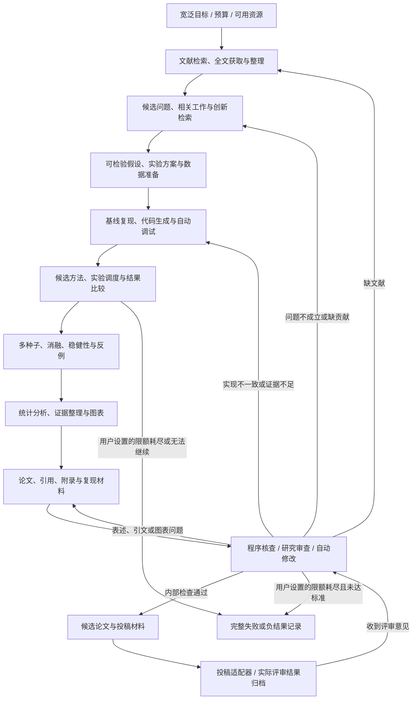

# 华小牛：全流程自动科研 Harness 主计划

版本：2026-10-10 / v4.2。状态：digits 与 YOLO 两个注册任务已接入 12 阶段流程，已完成两次 digits 和一次 YOLO 真实运行；自动灵感、最接近全文差异分析与期刊背景调查是下一项优先工作，通用研究、便携冻结重放与外部质量仍待推进。本文为唯一现行主计划。[此前的视觉实验助手设计](harness-design-v2.md)仅作为历史参考。

本计划是进阶与探索模块的路线图，科研、期刊与投稿资料不属于二面原题的默认必交项；主交付按题目功能模块单独整理。

## 1. 修正目标与结论

用户明确要求：**自动化所有研究流程，让系统从宽泛研究目标一直推进到有证据支撑的论文及完整复现材料，并在中间自动处理失败、补实验和修改。**

此前“读已有指标 → 检测图片 → 写报告”覆盖太少，不能当作全流程自动科研。本版把选题、文献、数据、代码、实验、分析、写作、核查、修改和投稿适配全部纳入目标。

核查三个前提后的结论：

| 前提 | 结论 | 依据 |
| --- | --- | --- |
| 旧方案能够保证产出好论文 | 不成立 | 当时没有选题、创新检索、方法设计、基线比较、消融与独立质量评价；旧 coco8 证据只能证明小样例训练流程 |
| 自动化所有步骤就能保证高质量 | 不成立 | 真实自动科研项目能生成整篇稿件，但仍有失败、方法与代码不一致、证据不足等问题 |
| 所有壁垒已经打通 | 尚未达到 | 两个固定任务已贯穿真实文献、实验、稿件与修改；研究策划还未驱动执行，任意代码沙箱、通用领域、深度阅读、便携冻结重放、独立质量评价及实际投稿尚未完成 |

**流程自动化是主要工程目标；论文质量是独立的科学目标。** 系统应自动寻找贡献、试验与反驳假设，能够产出支持结论的证据，也能够说明未发现有效贡献。不能把“生成 PDF”作为论文成功的唯一条件。

## 2. 重新参考真正的自动科研系统

Pi、Deep Agents、OpenHands 仍用来参考 Harness 的运行结构。新增三个科研系统参考，补齐科研流程：

| 参考 | 经官方资料核查的能力 | 借鉴的机制 | 质量证据的边界 |
| --- | --- | --- | --- |
| AI-Scientist-v2 | 假设生成、实验代码、调试、实验、分析、图表、引文、论文和自动审查 | 基础实现 → 基线调优 → 创新探索 → 消融；实验树和多种子复验 | 人类挑出的三篇稿件中一篇达到 workshop 评审门槛，按协议撤回；不能称为主会录用或正式发表 |
| HKUDS AI-Researcher | 文献/假设、算法实现、实验反馈、稿件准备；含给定方向与开放探索任务 | 文献到方法的衔接、研究角色分工、执行反馈与评价 | 框架论文的发表不等于每次自动研究产出的论文合格；“接近人类质量”是作者在其评估设置下的结果 |
| Agent Laboratory | 从人类提供的 idea 开始，自动文献综述、实验和研究报告 | 资源适配、分阶段产物、可选反馈、结果到写作的衔接 | 不证明自主选题已经解决；论文报告人类反馈能提升研究质量 |

来源：[AI-Scientist-v2 官方源码](https://github.com/SakanaAI/AI-Scientist-v2)、[实验管理器](https://github.com/SakanaAI/AI-Scientist-v2/blob/main/ai_scientist/treesearch/agent_manager.py)、[AI-Researcher 终版论文](https://proceedings.neurips.cc/paper_files/paper/2025/hash/0d904d300a105809a2114d727851e759-Abstract-Conference.html)、[AI-Researcher 官方仓库](https://github.com/HKUDS/AI-Researcher)、[Agent Laboratory 终版论文](https://aclanthology.org/2025.findings-emnlp.320/)、[Agent Laboratory 官方项目](https://agentlaboratory.github.io/)。介绍系统的论文在会议发表，是框架研究的成果，不能用来证明系统生成的每篇新论文获录用。

Sakana 的真实评审案例由人类给宽主题并筛选三篇投稿，其中一篇获得 6、7、6 分；之后按约定撤回，未做 meta-review。作者还说明三篇均未达到其内部 ICLR 主会标准。这证明全稿自动生成有实际案例，但不支持稳定产出高水平论文的承诺。[官方评审与局限说明](https://sakana.ai/ai-scientist-first-publication/)。

以上是参考来源。下面是本项目的长期设计；当前已实现范围及真实运行证据分别列在第 8、10、12 节，不将参考系统的能力当作本项目已经具备。

## 3. 一次启动后的完整研究闭环

用户选择可运行任务并填写本次分析重点，资源限额为可选项；需要时再从配置读取论文目标和账号。当前 `digits_robustness` 与 `yolo_tradeoff` 均接入科研协议、事件与稿件流程，网页默认展示 YOLO 的具体任务卡。目标输入不会自动更换登记的数据或任意生成方法。默认执行到本轮流程完成，不要求用户预先设定累计时长或调用次数。

以下闭环和阶段表描述长期自动化目标。当前 12 个阶段已有两个固定任务实现：digits 使用声明式配方，YOLO 使用同权重 320/480/640、FP32、batch=1 的固定评测，不训练、不改模型结构。阶段名称不代表已经实现开放选题、任意代码生成/调试、OCR、穷尽检索或真实投稿。



| 阶段 | 系统自动完成的工作 | 必须留下的产物 | 失败后的自动处理 |
| --- | --- | --- | --- |
| 1 文献发现 | 多轮关键词检索、追踪引用、去重、版本识别、寻找公开全文 | 文献元数据、检索式、覆盖范围、获取时间 | 退避重试、切换已接入来源；保留不可获得项 |
| 2 阅读整理 | 解析全文、公式/表格提取、建立方法/数据/结果/限制对照 | 原文定位、提取置信度、证据片段和关联文献 | OCR/其他解析器回退；无法可靠读取时标未知 |
| 3 选题与反证 | 生成多个候选、寻找高度相似工作、提出能被否证的假设 | 问题卡、相关工作差异、可行性和预期检验 | 淘汰已被覆盖/不可检验的题目，再生成候选 |
| 4 实验设计 | 选指标、基线、对照、种子、消融、失败判据和资源预算 | 在正式结果前保存的实验协议 | 缩小模型/实验规模或换题；保留改动原因 |
| 5 数据准备 | 获取允许的数据、格式转换、去重、数据检查、划分与版本固定 | 数据清单、哈希、划分和使用条件记录 | 选择适用替代数据，明确改变了研究范围 |
| 6 基线复现 | 获取代码、固定提交、建立环境、运行小样例和正式基线 | 环境锁定、代码提交、配置、原始日志与复现差异 | 自动定位报错、生成修复、测试并重跑；超过预算换路径 |
| 7 方法实现 | 把假设变成代码、验证改动确实生效，生成单元/性质检查 | 代码差异、方法说明和检查结果 | 自动修复；实现与假设矛盾则返回方法设计 |
| 8 调度与迭代 | 异步运行训练、比较候选、记录失败，按验证集反馈选下一实验 | 每次试验的代码/数据/配置/结果/耗时 | 重试可恢复故障；放弃持续失败分支；预算内探索新分支 |
| 9 复验与消融 | 多种子复跑、消融、资源匹配基线、稳健性与反例检查 | 重复结果、方差/区间、消融表与失败案例 | 优势消失则修改结论、补实验或换假设 |
| 10 分析与写作 | 从真实结果生成图表、统计摘要、正文、引用、附录和复现步骤 | 图表源数据、逐条主张与证据、稿件和代码材料 | 引用/数值校验失败则自动改稿；发现证据缺口返回实验 |
| 11 审查与修改 | 方法—代码对照、数值与引用检查、研究批评、修改及补实验 | 问题清单、处置记录、各版本及未解决项 | 自动按问题类别回退，预算内循环到检查通过 |
| 12 投稿与反馈 | 适配目标格式、生成附件/元数据/声明；按指定渠道接口提交与归档 | 投稿包、实际提交状态；收到反馈后生成修改计划 | 渠道/权限不可用时保留材料和具体阻塞，不能伪造提交成功 |

默认研究过程中不设每阶段人工确认。人类可随时纠正方向或提供专业意见，但是否介入及介入内容必须记录，才能区分自主运行与协作运行。

## 4. 每个阶段之间怎样真正接通

统一 `ResearchState`：目标、预算、文献 ID、假设 ID、实验协议 ID、数据版本、代码提交、试验 ID、证据 ID、主张 ID、稿件版本和待解决问题。

主要对象及关联：

```text
ResearchGoal
  └─ LiteratureRecord / SourceEvidence
       └─ Hypothesis + RefutationCheck
            └─ ExperimentProtocol
                 └─ Trial(code_commit, data_hash, config, seed, environment)
                      └─ RawResult → Analysis → Claim(evidence_ids)
                           └─ Manuscript(version, claim_ids, citation_ids)
                                └─ ReviewIssue → Revision / NewTrial
```

阶段输出必须通过契约校验后才能作为下一阶段输入。仅有一句“基线已完成”不能推进；需要对应试验、日志、结果和协议符合性记录。工具返回 `ok/status/artifact_ids/error/duration`，不通过则产生明确的失败状态。

所有论文数值和图表从原始结果及分析代码生成。引用关联真实文献元数据与原文定位；只有题目或摘要时标明获取范围，不当作已阅读全文。图表、方法、主张和试验都能互相追溯。便携冻结重放与新环境独立复现是尚未实现的验收项，不能由“已归档”或“哈希一致”代替。

候选筛选基于训练/验证信息，最终评测使用冻结协议。digits 共享隔离 holdout；YOLO 使用 COCO128 样例的选择/评测划分，预训练可能见过样本，不能当作独立泛化验证。探索产生的变化保留版本，不能在看见最终测试结果后继续调参并把它包装成未见测试。看过最终测试后若继续修改方法，该测试结果降级为探索证据；新的确认性结论使用新的独立保留集或锁定外部评测，仅换一份协议不能让同一测试集恢复为未见数据。没有新数据时保留适应性评测历史并限制结论。

## 5. 论文质量检查与返工规则

自动审稿负责发现问题和安排返工，LLM 分数不能单独作为高质量证明。写作、批评使用不同上下文；条件允许时采用不同模型，但增加角色或模型数量也不自动保证正确。

| 检查 | 通过需要的依据 | 不通过自动做什么 |
| --- | --- | --- |
| 研究问题与贡献 | 清晰、可检验的问题；与已检索相关工作的具体区别；意义和适用范围 | 扩展检索、改题；注明检索未发现重复不等于证明全球首创 |
| 基线与公平性 | 适当基线，匹配数据、训练/搜索预算及评测条件；复现偏差说明 | 补基线、调整比较；无法公平比较则收窄结论 |
| 实现与论文一致 | 关键模块存在且生效；消融符合描述；方法能对应代码位置 | 修代码或改方法叙述，重新实验 |
| 实验可信度 | 完整原始记录、固定划分、多种子与有效统计分析；失败未被删除 | 复跑、补实验，按结果更新结论 |
| 主张与证据 | 主要结论有对应试验/理论依据；相关性和因果、局部和普遍范围分清 | 删除或减弱不支持的主张；有意义时安排针对性实验 |
| 引用与图表 | 引文可核查且支持该说法；图表重生成；正文数值一致 | 自动重新检索、改引用/图表/正文 |
| 可复现性 | 新环境按锁定配置跑通；代码、数据获取、种子、依赖和预算明确 | 修环境和脚本，重新做独立复现 |
| 外部质量 | 领域研究者/真实评审的实际意见与结果 | 收到反馈后自动提出并执行允许的修改；未获得时状态为未评定 |

“内部检查通过的候选稿”“外部评审通过”“正式发表”分别保存状态。任何阶段不得把后续状态提前写成成功。

有价值的负结果可以形成研究贡献，但需要问题意义、实验有效性和证据，不是把无效试验换个标题。未发现贡献且本轮结束、无法继续或用户设置的限额耗尽时交付完整失败/负结果材料，不编造涨点或创新点。

## 6. Harness 运行核心如何支撑长任务

继续参考 Pi 的模型访问、执行循环、上下文投影和事件分层；保留 Deep Agents 的任务/上下文管理思路和 OpenHands 的 Action/Observation 契约。已经采用 LangGraph 为唯一图执行引擎，Python/FastAPI 为控制服务。

科研任务应支持长程执行，旧方案的“180 秒整任务、五轮工具、十次调用”不能直接套用。用户指出首版科研 UI 默认 20 分钟、12 次模型请求和 18 次拟合的硬限不符合持续推进目标，因此改为默认执行到本轮完成，累计资源只作实际记录。用户可在高级选项主动设置累计时长/模型请求/实验作业限额，空值或 null 表示无限额；单次请求保留超时和可恢复故障处理。恢复不清零实际计数，也不删除失败试验。

当前已经累计模型请求、实验作业和实际耗时；digits 作业为拟合，YOLO 作业为评测并单独记录 0 次训练。GPU 时间、存储配额、模型费用和作业级限额是扩展目标，未实施前不能声称已经统一计量。付费资源、账号和对外发布仍按实际授权与配置处理，不由模型自行购买或扩张。

运行角色按需顺序调度：文献整理、假设设计、代码实现、实验管理、分析写作、审查。它们是职责和独立上下文，首版无需同时加载多个模型。最终推进由状态契约与检查决定，调度者不能自行跳过失败检查。

| 运行模块 | 要解决的问题 |
| --- | --- |
| `ResearchController` | 选择阶段、处理返工、管理总预算、记录人类介入 |
| `ProviderRouter` | 本地/已配置外部模型的能力与费用配置，失败回退和每次请求限时 |
| `LiteratureService` | 检索、下载、解析、去重、引用核查和缓存 |
| `ExperimentRunner` | 隔离执行生成代码、作业队列、GPU 锁、日志和故障修复 |
| `EvidenceStore` | 文献—假设—代码—试验—主张—稿件关联；SQLite 与文件哈希 |
| `QualityChecks` | 程序校验、研究审查、返工路由；区分确定性检查与模型判断 |
| `ManuscriptBuilder` | 图表、稿件、引用、附录、编译检查和投稿包 |
| `SubmissionAdapter` | 指定渠道的准备/实际提交状态，以及评审意见导入 |
| `ResearchUI` | 显示研究阶段、试验、预算、证据、失败和论文版本；支持取消/恢复 |

当前 digits 与 YOLO 已经各有数据、实验、文献和稿件适配器，共用状态、资源记录、模型路由、事件、恢复与产物接口。YOLO 独立视觉检测页仍可单独使用，但已不再是唯一的目标检测入口。上表中的任意代码隔离、通用作业队列、GPU 锁和实际投稿仍是设计目标，不能由组件名称推断已实现。

## 7. 持久化、自动恢复与代码执行

LangGraph 检查点与应用工具账本分别管理。先保存待执行动作及稳定 ID，再执行；结果和成功事件提交应用数据库后才显示成功。检查点落盘前中断时，恢复从账本复用已保存结果，不假设两个数据库有共同事务。

以下为大型训练作业的扩展目标；当前 sklearn 拟合与 YOLO GPU 评测在可信固定 runner 中执行，不代表已经支持任意 GPU 长作业管理。训练属于异步作业：记录作业 ID、进程身份、设备、工作目录、代码/数据/配置哈希、检查点位置、心跳和状态。控制服务重启后自动核对作业仍在运行、已完成或需恢复，不直接启动第二份训练。训练恢复必须确认权重、优化器和配置可匹配；不支持恢复的作业显式重新启动并记录。

代码生成与运行放在独立工作区和受控执行环境。项目原目录作为输入，不允许生成代码任意改动；训练/验证数据与独立最终测试分开提供。限制单作业内存、GPU、时间与输出大小，子进程结束后回收资源。Windows 下已有 Docker/WSL 可用性探测，但未配置和验证任意生成代码的镜像、挂载、网络及资源隔离策略，不能声称已有代码沙箱。当前只运行登记的可信代码；输入校验与只读写作 CLI 不能替代代码沙箱。

自动修复目标：收集报错与日志 → 定位问题 → 生成变更 → 语法/小样例检查 → 重跑。大型代码实验的修复次数应依据失败性质与进展决定；当前结构化模型响应有有限重试和记录在案的回退，任意生成代码自动调试尚未接入。YOLO 本轮完成包含开发者修复和恢复，不能作为自主代码调试的验收依据。重试留下实际资源记录，并遵守用户主动设置的限额。

论文和图表先保存规范数据，再导出文件并按哈希核对已完成输出。当前 PDF 由 ReportLab 生成，TeX 仅导出源码；自动收集并修复 TeX 编译诊断尚未实现。后续编译失败时应保留源稿和错误，不能报告“PDF已生成”。投稿外部写入若结果不确定，先查询回执，禁止盲目重复提交。

## 8. 各种壁垒目前到哪一步

| 壁垒 | 当前已经接通 | 仍需实现或验证 | 当前状态 |
| --- | --- | --- | --- |
| 工具之间不互通 | 两个注册任务共用阶段契约、任务/事件/产物 ID、API 与 MCP | 新专业工具仍需领域适配器 | digits 与 YOLO 已运行 |
| 文献获取与理解 | Crossref/arXiv 检索、公开 arXiv PDF 下载、文本提取和范围记录 | 付费全文、公式/表格可靠解析、最接近全文差异矩阵和引用语义核验 | digits 运行读 2 篇、YOLO 运行读 1 篇公开全文，覆盖有限 |
| 环境与代码错误 | 独立科研环境、固定 runner 校验、模型结构化重试/回退、源码一致性检查 | 任意代码隔离、生成/调试、OOM 和依赖自动修复 | YOLO 恢复含开发者修复；通用自动调试未做 |
| 时间和模型能力 | 实际耗时、请求和实验作业累计，取消/恢复；Codex CLI 写作真实成功 | GPU/费用统一计量、跨领域能力比较和更深搜索 | 默认持续本轮；限额为用户可选项 |
| 研究知识与创新 | 问题/限制记录、两种固定实验；策略页保存 3 个想法和 3 个期刊要求 | 自动灵感、全文差异矩阵、期刊背景调查进入执行决策 | 策划材料固定，创新未验证；用户要求优先补齐 |
| 结果到论文 | CSV 数值/图表、稿件、审查、保留版本与完整归档 | 模型解释的领域正确性、深层相关工作、TeX 编译和独立质量 | 已生成候选稿，不保证高质量 |
| 独立复现 | 当时的源码、原始测量、数据/权重、环境与哈希归档 | 便携冻结重放入口、依赖/路径迁移与新环境独立运行 | 未实现；当前项目模块只能产生新测量 |
| 投稿和发表 | 材料与 not_submitted 状态、期刊要求和编辑询问草稿 | 作者、账号、指定渠道适配和回执；真实评审 | 草稿未发送，实际未投稿 |
| 硬件与物理实验 | 用户 2026-10-10 确认硬件已完成 | 若需要科研联动，另核对具体设备、测量接口和证据；PID 层级尚未知 | 硬件按已完成记录，不推断全部加分层级 |

参考元数据入口：[Crossref 官方 REST API](https://www.crossref.org/documentation/retrieve-metadata/rest-api/)、[OpenAlex 官方帮助与 API 入口](https://help.openalex.org/)。元数据获取成功不等于论文全文获取成功。实施时核对来源当前权限和限额，遇限额记录并退避；不足的文献覆盖会影响创新判断。

## 9. 本机条件与模型能力验证

已有环境：Python 3.11、Ollama qwen2.5:7b、RTX 5070 Laptop 约 8GB 显存、FastAPI、Ultralytics。科研 `.venv` 增加 LangGraph、SQLite 检查点、sklearn、ReportLab 与 pypdf；`.venv-mcp` 独立安装 MCP SDK。除基础调用和 YOLO 小样例外，已完成两次 digits 和一次 YOLO 固定任务全流程研究。[现有核验记录](verification.md)、[训练记录](training_result.json)、[YOLO 科研运行](../evidence/research-yolo-runtime-smoke.json)。

qwen2.5:7b 在真实全流程中出现结构化响应回退，不能据一次成功宣称稳定的科研级阅读、长程规划或代码修复。论文分析、审查、修订已使用现有已登录 Codex CLI 完成真实调用；DeepSeek/OpenAI 适配未有真实密钥验证。后续应继续做跨领域能力试验：核查引用、设计对照实验、修一个真实训练错误、从 CSV 提取准确结论、指出一段代码与方法说明的矛盾。保存每项成功率、错误、耗时与模型配置，再决定哪些角色可用本地模型承担。

能力不足时只使用已经配置且允许调用的外部 provider；不把未来 API、购买算力或高性能模型写成已有条件。全本地模式必须保留能力限制说明。后续需实现模型与实验共用 GPU 时的全局互斥调度；当前单研究 worker 不等于所有应用共享 GPU 锁。

coco8 的 4 张训练图/4 张验证图继续作为安装、训练和接口的快速检查数据，已被训练使用的验证图不能作为独立最终测试。YOLO 科研当前改用 COCO128 样例，排除 8 个已知 COCO8 和 2 个缺标注文件的样本，余下 118 张作 59/59 划分；预训练重叠可能仍在。这个固定精度—延迟基准也不足以支持普遍泛化或创新方法结论。

## 10. 开发顺序：先贯穿完整链路，再提高研究质量

每个阶段通过实际验收后才勾选，不把模块计划当成果。digits 高斯增强分类实验之后，已接入 YOLO 固定精度—延迟基准。下一项优先补研究策划如何影响执行，再扩大方法与数据范围。当前里程碑进度如下：

| 里程碑 | 目标 | 当前依据及剩余项 |
| --- | --- | --- |
| M0 定义与接入 | 输入、契约、能力、数据与执行边界 | 两个注册任务具备独立环境、契约、固定划分和可信 runner；YOLO 为固定评测、0 训练，任意代码不执行 |
| M1 贯穿全过程 | 文献 → 问题 → 协议 → 数据 → 实验 → 稿件 → 核查修改 → 材料 | 两次 digits 和一次 YOLO 完成 12 阶段；YOLO 含开发者修复后恢复，不能称全程自主调试；全文深度有限、投稿只到材料 |
| M2 可靠执行 | 检查点、防重、取消、恢复与故障处理 | 单 worker、幂等账本、持久图、哈希、模型重试/回退与 YOLO 源码变化拒绝恢复已实现并有离线回归；通用作业、OOM、任意代码和 TeX 故障修复未做 |
| M3 科学质量 | 公平比较、多种子、隔离评测、主张核查、独立复现 | digits 共享 holdout，YOLO 59/59 选择/评测并保留预训练重叠限制，CSV 核查和代价保留已实现；复杂消融、便携冻结重放、全新环境独立复现仍待完成 |
| M4 模型与搜索改进 | 基于真实失败优化上下文、角色与实验选择 | Codex 论文角色与混合回退已有记录；策略页 3 个想法、3 个期刊要求为固定资料，自动灵感/全文差异矩阵/期刊背调进入决策尚未实现，当前优先推进 |
| M5 外部验证与投稿接入 | 独立评价、指定渠道适配和回执 | 自动生成材料与编辑询问草稿，创新未验证、外部未评价、not_submitted；草稿未发送，真实渠道与评价未接入 |

M1 先接通每个环节，允许深度有限；M3 才能提高方法与证据的可信度。M1 跑通不能自动称为高水平论文产出。二面展示完整链路、稿件自动修改与真实证据，同时明确开发者修复记录，后续学术质量按真实结果积累。

## 11. 两套验收标准

### 流程自动化验收

目标是初始方向、数据访问与环境准备完成后，系统自行执行检索、选题、实现、实验、分析、写作、检查与返工；累计资源限额由用户可选设置。当前实现步骤是固定 runner 的配方配置或固定评测，不能把它说成任意代码自动编程。全过程应保存人工介入内容；手工拷贝结果、手工修代码、手工启动训练和手工改图表都算介入。运行账本的人工恢复计数不涵盖全部开发修复，计数为 0 不能证明开发阶段没有人为参与。

已保存两次 digits 与一次 YOLO 贯穿运行及模型响应处理记录；YOLO 失败后经开发者修复并恢复完成，属于协作恢复证据。任意代码自动修复或其他故障只有在对应证据存在时才分别计通过。阶段输出能被下一阶段直接读取，恢复复用已登记结果并核查源码/产物一致性。投稿包自动生成单独验收，指定渠道实际提交再独立验收。

### 研究质量验收

用相关工作差异、合理研究问题、有效对照、重复/消融、原始数据、方法与实现一致性、准确引用和独立复现评价。外部研究者或真实评审提供进一步证据，未完成前只标“内部检查通过候选稿”。

不以是否涨点作为唯一价值标准，不以自动审稿分数替代真实质量。系统在本轮结束或用户主动设置的限额内未找到有价值贡献时输出完整研究记录和未通过项；必须保留负结果，避免只挑最好看的试验。

## 12. 当前交付与下一项

### 2026-10-08/09 已交付记录

当时交付了 digits 固定领域自动科研工作台。两次贯穿运行均完成 12 阶段；第二次运行 `dd98c3f59cc34e73b7d2be3e3ec36899` 为 454.031 秒、7 次模型请求、18 次真实拟合、55 个产物 HTTP 下载哈希一致、研究内 0 次人工介入。论文分析、审查与修订三个 Codex CLI 调用真实成功，原稿和第二版保留。来源：[运行证据](../evidence/research-writer-runtime-smoke.json)、[核验记录](verification.md)、[工作台操作](research-workbench.md)。

用户已手动确认桌面科研页能打开、布局正常。已按其反馈将累计时长/请求/拟合硬限改为可选高级设置，默认执行到本轮完成；实际资源记录保留。最新第四版把已有分析写入讨论正文，10 个数字 token 全部核查、未知值为 0，旧 67 个产物保留，累计 79 个下载哈希一致，新增模型请求/拟合为 0；MCP 八工具的真实 stdio 只读核验完成。第四版 PDF 三页已经独立渲染读图通过，后台实际 stop→start 已记录；最终 Python 117 项中的 115 通过/2 跳过与 Node 27 项通过。新增 DeepSeek 网页 Key 设置、官方模型连接测试、原子保存与论文 writer 即时切换，失败保留旧配置；未填真实 Key，云端实际论文调用仍待核验。最新资源/论文设置表单及小屏视觉尚未实测，状态见 [主清单](checklist.md)。

digits 研究表明当时设置的噪声准确率提升，同时干净准确率下降；这支持局部增强效果，不支持创新算法、通用鲁棒性或高水平论文承诺。

### 2026-10-10 当前状态与优先项

第二个任务 `yolo_tradeoff` 已真正接入科研流水线。运行 `bd8c2a7ccaff4ae4b3be7f7e6fa13c43` 已完成：202.0 秒、6 次模型请求、5 个评测作业、0 次训练，306 个登记产物 HTTP 下载哈希一致。实验固定同一权重、320/480/640、FP32、batch=1。COCO128 剔除 8 个已知 COCO8 与 2 个缺标注文件样本后作 59/59 选择/评测；预训练重叠可能，不能称独立泛化。选定 480 在冻结评测中没有保持选择集速度优势，负结果已保留。恢复含开发者修复，不是自主代码调试。来源：[YOLO 运行证据](../evidence/research-yolo-runtime-smoke.json)。

用户 2026-10-10 确认硬件已完成；PID 层级尚未确认。策略页 `/research/strategy` 已提供首批三个想法、三个期刊官方要求和编辑询问草稿，详见 [想法与期刊资料](yolo-ideas-and-venues.md)、[询问草稿](editor-inquiry-draft.md)。这些是固定策划资料，尚未进入实验决策，草稿未发送。实际投稿与外部评价仍未发生。

**下一项按用户要求优先打通研究策划：** 自动发现候选想法 → 阅读最接近工作的全文并产出可定位的差异矩阵 → 按官方来源记录期刊范围、要求及查询日期 → 据证据淘汰/修改题目并形成实验协议 → 将协议接入实际执行与写作。三份静态想法或期刊卡不能代替这个闭环；自动研究也不保证录用。

同时保留两个明确缺项：便携冻结重放、新环境独立复现。目前归档含本机路径和项目依赖，没有可直接独立运行的重放入口；调用当前项目模块只是新测量。先补源码、依赖、数据和路径的可迁移执行入口，再独立验收，不能把归档成功写成已复现。任意代码沙箱与自动调试、深层引用核验、具体渠道实际投稿仍按后续目标推进。
