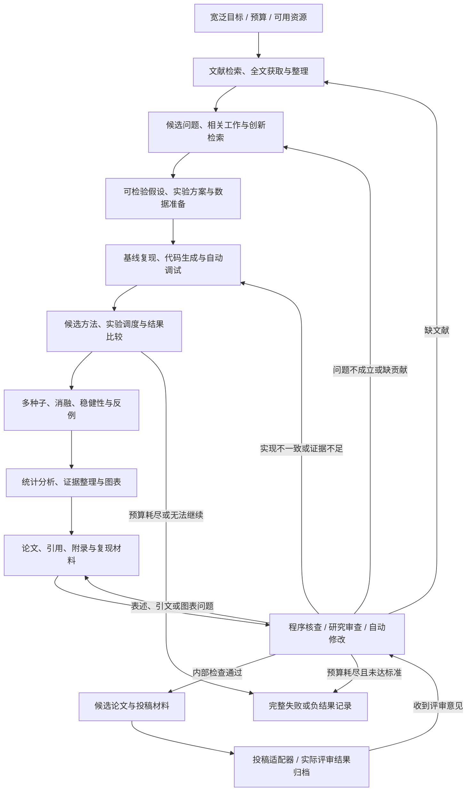

# 华小牛：全流程自动科研 Harness 主计划

版本：2026-10-08 / v3。状态：设计已修订，系统尚未实施。本文为唯一现行主计划。[此前的视觉实验助手设计](harness-design-v2.md)仅作为历史参考。

## 1. 修正目标与结论

用户明确要求：**自动化所有研究流程，让系统从宽泛研究目标一直推进到有证据支撑的论文及完整复现材料，并在中间自动处理失败、补实验和修改。**

此前“读已有指标 → 检测图片 → 写报告”覆盖太少，不能当作全流程自动科研。本版把选题、文献、数据、代码、实验、分析、写作、核查、修改和投稿适配全部纳入目标。

核查三个前提后的结论：

| 前提 | 结论 | 依据 |
| --- | --- | --- |
| 旧方案能够保证产出好论文 | 不成立 | 没有选题、创新检索、方法设计、基线比较、消融与独立质量评价；当前 coco8 证据只能证明小样例训练流程 |
| 自动化所有步骤就能保证高质量 | 不成立 | 真实自动科研项目能生成整篇稿件，但仍有失败、方法与代码不一致、证据不足等问题 |
| 所有壁垒已经打通 | 尚未达到 | 当前无完整研究运行、文献库、代码沙箱、实验调度、论文编译和质量验收；账号、数据与计算资源也有实际依赖 |

**流程自动化是主要工程目标；论文质量是独立的科学目标。** 系统应自动寻找贡献、试验与反驳假设，能够产出支持结论的证据，也能够说明未发现有效贡献。不能把“生成 PDF”作为论文成功的唯一条件。

## 2. 重新参考真正的自动科研系统

Pi、Deep Agents、OpenHands 仍用来参考 Harness 的运行结构。新增三个科研系统参考，补齐科研流程：

| 参考 | 经官方资料核查的能力 | 借鉴的机制 | 质量证据的边界 |
| --- | --- | --- | --- |
| AI-Scientist-v2 | 假设生成、实验代码、调试、实验、分析、图表、引文、论文和自动审查 | 基础实现 → 基线调优 → 创新探索 → 消融；实验树和多种子复验 | 人类挑出的三篇稿件中一篇达到 workshop 评审门槛，按协议撤回；不能称为主会录用或正式发表 |
| HKUDS AI-Researcher | 文献/假设、算法实现、实验反馈、稿件准备；含给定方向与开放探索任务 | 文献到方法的衔接、研究角色分工、执行反馈与评价 | 框架论文的发表不等于每次自动研究产出的论文合格；“接近人类质量”是作者在其评估设置下的结果 |
| Agent Laboratory | 从人类提供的 idea 开始，自动文献综述、实验和研究报告 | 资源适配、分阶段产物、可选反馈、结果到写作的衔接 | 不证明自主选题已经解决；论文报告人类反馈能提升研究质量 |

来源：[AI-Scientist-v2 官方源码](https://github.com/SakanaAI/AI-Scientist-v2)、[实验管理器](https://github.com/SakanaAI/AI-Scientist-v2/blob/main/ai_scientist/treesearch/agent_manager.py)、[AI-Researcher 终版论文](https://proceedings.neurips.cc/paper_files/paper/2025/hash/0d904d300a105809a2114d727851e759-Abstract-Conference.html)、[AI-Researcher 官方仓库](https://github.com/HKUDS/AI-Researcher)、[Agent Laboratory 终版论文](https://aclanthology.org/2025.findings-emnlp.320/)、[Agent Laboratory 官方项目](https://agentlaboratory.github.io/)。介绍系统的论文在会议发表，是框架研究的成果，不能用来证明系统生成的每篇新论文获录用。

Sakana 的真实评审案例由人类给宽主题并筛选三篇投稿，其中一篇获得 6、7、6 分；之后按约定撤回，未做 meta-review。作者还说明三篇均未达到其内部 ICLR 主会标准。这证明全稿自动生成有实际案例，但不支持稳定产出高水平论文的承诺。[官方评审与局限说明](https://sakana.ai/ai-scientist-first-publication/)。

以上事实与后续设计分开：下面的阶段、契约、质量规则和预算是本项目的方案，尚未通过本机运行验证。

## 3. 一次启动后的完整研究闭环

用户初始提供或从配置读取：宽泛方向、计算/模型调用预算、允许的数据来源、论文目标和可用账号。无需预先写好完整研究方法。方向暂未确定时先搭建通用流程，现有目标检测模块可作为第一个领域适配器。



| 阶段 | 系统自动完成的工作 | 必须留下的产物 | 失败后的自动处理 |
| --- | --- | --- | --- |
| 1 文献发现 | 多轮关键词检索、追踪引用、去重、版本识别、寻找公开全文 | 文献元数据、检索式、覆盖范围、获取时间 | 退避重试、切换已接入来源；保留不可获得项 |
| 2 阅读整理 | 解析全文、公式/表格提取、建立方法/数据/结果/限制对照 | 原文定位、提取置信度、证据片段和关联文献 | OCR/其他解析器回退；无法可靠读取时标未知 |
| 3 选题与反证 | 生成多个候选、寻找高度相似工作、提出能被否证的假设 | 问题卡、相关工作差异、可行性和预期检验 | 淘汰已被覆盖/不可检验的题目，再生成候选 |
| 4 实验设计 | 选指标、基线、对照、种子、消融、失败判据和资源预算 | 在正式结果前保存的实验协议 | 缩小模型/实验规模或换题；保留改动原因 |
| 5 数据准备 | 获取允许的数据、格式转换、去重、数据检查、划分与版本固定 | 数据清单、哈希、划分和使用条件记录 | 选择适用替代数据，明确改变了研究范围 |
| 6 基线复现 | 获取代码、固定提交、建立环境、运行小样例和正式基线 | 环境锁定、代码提交、配置、原始日志与复现差异 | 自动定位报错、生成修复、测试并重跑；超过预算换路径 |
| 7 方法实现 | 把假设变成代码、验证改动确实生效，生成单元/性质检查 | 代码差异、方法说明和检查结果 | 自动修复；实现与假设矛盾则返回方法设计 |
| 8 调度与迭代 | 异步运行训练、比较候选、记录失败，按验证集反馈选下一实验 | 每次试验的代码/数据/配置/结果/耗时 | 重试可恢复故障；放弃持续失败分支；预算内探索新分支 |
| 9 复验与消融 | 多种子复跑、消融、资源匹配基线、稳健性与反例检查 | 重复结果、方差/区间、消融表与失败案例 | 优势消失则修改结论、补实验或换假设 |
| 10 分析与写作 | 从真实结果生成图表、统计摘要、正文、引用、附录和复现步骤 | 图表源数据、逐条主张与证据、稿件和代码材料 | 引用/数值校验失败则自动改稿；发现证据缺口返回实验 |
| 11 审查与修改 | 方法—代码对照、数值与引用检查、研究批评、修改及补实验 | 问题清单、处置记录、各版本及未解决项 | 自动按问题类别回退，预算内循环到检查通过 |
| 12 投稿与反馈 | 适配目标格式、生成附件/元数据/声明；按指定渠道接口提交与归档 | 投稿包、实际提交状态；收到反馈后生成修改计划 | 渠道/权限不可用时保留材料和具体阻塞，不能伪造提交成功 |

默认研究过程中不设每阶段人工确认。人类可随时纠正方向或提供专业意见，但是否介入及介入内容必须记录，才能区分自主运行与协作运行。

## 4. 每个阶段之间怎样真正接通

统一 `ResearchState`：目标、预算、文献 ID、假设 ID、实验协议 ID、数据版本、代码提交、试验 ID、证据 ID、主张 ID、稿件版本和待解决问题。

主要对象及关联：

```text
ResearchGoal
  └─ LiteratureRecord / SourceEvidence
       └─ Hypothesis + RefutationCheck
            └─ ExperimentProtocol
                 └─ Trial(code_commit, data_hash, config, seed, environment)
                      └─ RawResult → Analysis → Claim(evidence_ids)
                           └─ Manuscript(version, claim_ids, citation_ids)
                                └─ ReviewIssue → Revision / NewTrial
```

阶段输出必须通过契约校验后才能作为下一阶段输入。仅有一句“基线已完成”不能推进；需要对应试验、日志、结果和协议符合性记录。工具返回 `ok/status/artifact_ids/error/duration`，不通过则产生明确的失败状态。

所有论文数值和图表从原始结果及可重跑分析脚本生成。引用关联真实文献元数据与原文定位；只有题目或摘要时标明获取范围，不当作已阅读全文。图表、方法、主张和试验都能互相追溯。

候选筛选基于训练/验证信息；独立最终评测使用冻结协议和隔离的测试数据。探索产生的变化保留版本，不能在看见最终测试结果后继续调参并把它包装成未见测试。看过最终测试后若继续修改方法，该测试结果降级为探索证据；新的确认性结论使用新的独立保留集或锁定外部评测，仅换一份协议不能让同一测试集恢复为未见数据。没有新数据时保留适应性评测历史并限制结论。

## 5. 论文质量检查与返工规则

自动审稿负责发现问题和安排返工，LLM 分数不能单独作为高质量证明。写作、批评使用不同上下文；条件允许时采用不同模型，但增加角色或模型数量也不自动保证正确。

| 检查 | 通过需要的依据 | 不通过自动做什么 |
| --- | --- | --- |
| 研究问题与贡献 | 清晰、可检验的问题；与已检索相关工作的具体区别；意义和适用范围 | 扩展检索、改题；注明检索未发现重复不等于证明全球首创 |
| 基线与公平性 | 适当基线，匹配数据、训练/搜索预算及评测条件；复现偏差说明 | 补基线、调整比较；无法公平比较则收窄结论 |
| 实现与论文一致 | 关键模块存在且生效；消融符合描述；方法能对应代码位置 | 修代码或改方法叙述，重新实验 |
| 实验可信度 | 完整原始记录、固定划分、多种子与有效统计分析；失败未被删除 | 复跑、补实验，按结果更新结论 |
| 主张与证据 | 主要结论有对应试验/理论依据；相关性和因果、局部和普遍范围分清 | 删除或减弱不支持的主张；有意义时安排针对性实验 |
| 引用与图表 | 引文可核查且支持该说法；图表重生成；正文数值一致 | 自动重新检索、改引用/图表/正文 |
| 可复现性 | 新环境按锁定配置跑通；代码、数据获取、种子、依赖和预算明确 | 修环境和脚本，重新做独立复现 |
| 外部质量 | 领域研究者/真实评审的实际意见与结果 | 收到反馈后自动提出并执行允许的修改；未获得时状态为未评定 |

“内部检查通过的候选稿”“外部评审通过”“正式发表”分别保存状态。任何阶段不得把后续状态提前写成成功。

有价值的负结果可以形成研究贡献，但需要问题意义、实验有效性和证据，不是把无效试验换个标题。未发现贡献且预算耗尽时交付失败/负结果材料，不编造涨点或创新点。

## 6. Harness 运行核心如何支撑长任务

继续参考 Pi 的模型访问、执行循环、上下文投影和事件分层；保留 Deep Agents 的任务/上下文管理思路和 OpenHands 的 Action/Observation 契约。暂定 LangGraph 为唯一图执行引擎，Python/FastAPI 为控制服务。

科研任务必须支持数小时甚至更长的执行，旧方案的“180 秒整任务、五轮工具、十次调用”不能直接套用。改为四类预算：每次模型请求限时、每次工具/训练作业限额、一个研究阶段预算、整个研究项目总预算。次数、GPU 时间、墙钟时间、存储、模型费用分别累计，恢复不清零；外部资源申请和预算扩张不能由模型无条件决定。

运行角色按需顺序调度：文献整理、假设设计、代码实现、实验管理、分析写作、审查。它们是职责和独立上下文，首版无需同时加载多个模型。最终推进由状态契约与检查决定，调度者不能自行跳过失败检查。

| 运行模块 | 要解决的问题 |
| --- | --- |
| `ResearchController` | 选择阶段、处理返工、管理总预算、记录人类介入 |
| `ProviderRouter` | 本地/已配置外部模型的能力与费用配置，失败回退和每次请求限时 |
| `LiteratureService` | 检索、下载、解析、去重、引用核查和缓存 |
| `ExperimentRunner` | 隔离执行生成代码、作业队列、GPU 锁、日志和故障修复 |
| `EvidenceStore` | 文献—假设—代码—试验—主张—稿件关联；SQLite 与文件哈希 |
| `QualityChecks` | 程序校验、研究审查、返工路由；区分确定性检查与模型判断 |
| `ManuscriptBuilder` | 图表、稿件、引用、附录、编译检查和投稿包 |
| `SubmissionAdapter` | 指定渠道的准备/实际提交状态，以及评审意见导入 |
| `ResearchUI` | 显示研究阶段、试验、预算、证据、失败和论文版本；支持取消/恢复 |

现有 YOLO、指标读取和报告功能成为领域插件与底层工具，目标是接入完整研究流程。通用 Harness 与专业工具分开扩展：新增领域时复用状态、预算、记录和返工机制，再增加领域数据/实验/评测适配器。

## 7. 持久化、自动恢复与代码执行

LangGraph 检查点与应用工具账本分别管理。先保存待执行动作及稳定 ID，再执行；结果和成功事件提交应用数据库后才显示成功。检查点落盘前中断时，恢复从账本复用已保存结果，不假设两个数据库有共同事务。

训练属于异步作业：记录作业 ID、进程身份、设备、工作目录、代码/数据/配置哈希、检查点位置、心跳和状态。控制服务重启后自动核对作业仍在运行、已完成或需恢复，不直接启动第二份训练。训练恢复必须确认权重、优化器和配置可匹配；不支持恢复的作业显式重新启动并记录。

代码生成与运行放在独立工作区和受控执行环境。项目原目录作为输入，不允许生成代码任意改动；训练/验证数据与独立最终测试分开提供。限制单作业内存、GPU、时间与输出大小，子进程结束后回收资源。Windows 下优先评估 WSL2/Docker 或等效隔离方案，尚未安装、验证，不能声称已有代码沙箱。

自动修复：收集报错与日志 → 定位问题 → 生成变更 → 语法/小样例检查 → 重跑。默认每个错误最多三次修复尝试，失败则换实验分支或记录不能继续；重试会消耗项目预算。

论文和图表先保存规范数据，再使用导出队列生成文件，按哈希核对已完成输出。编译失败自动收集诊断并修复；仍失败则保留源稿和错误，不能报告“PDF已生成”。投稿外部写入若结果不确定，先查询回执，禁止盲目重复提交。

## 8. 各种壁垒目前到哪一步

| 壁垒 | 准备怎样自动处理 | 仍不能抹掉的条件 | 当前状态 |
| --- | --- | --- | --- |
| 工具之间不互通 | 统一对象、ID、状态契约与证据关联 | 每个专业工具需要实现适配器 | 未实现 |
| 文献获取与理解 | 多来源检索、公开全文回退、解析检查和缓存 | 付费/不可访问全文、解析失败和检索遗漏需要如实记录 | 未实现 |
| 环境与代码错误 | 依赖固定、隔离环境、自动测试/调试/修复 | 实际环境和依赖能力必须可用 | 仅已有基础项目可运行 |
| GPU、时间和模型能力 | 单 GPU 队列、资源测量、小样例筛选、能力测试与预算分配 | 8GB 显存、资金、作业时长不会被架构消除 | 有本机 GPU；新流程未实测 |
| 研究知识与创新 | 阅读、反证、候选淘汰、方法探索和实验反馈 | 创新与科学价值不能由搜索未命中或 LLM 自评保证 | 未验证 |
| 结果到论文 | 可核查主张、模板化事实、自动图表/引用/编译 | 高质量论证、有效实验和外部评审仍有不确定性 | 未实现 |
| 投稿和发表 | 指定渠道适配、材料生成、状态核查、意见到返工 | 作者信息、账号、渠道要求和评审决定是外部条件 | 尚无指定渠道或配置 |
| 真实物理实验 | 领域设备适配、传感数据记录和实验调度 | 必须有实际设备/样品/测量条件 | 未提供；不能用模拟冒充实测 |

参考元数据入口：[Crossref 官方 REST API](https://www.crossref.org/documentation/retrieve-metadata/rest-api/)、[OpenAlex 官方帮助与 API 入口](https://help.openalex.org/)。元数据获取成功不等于论文全文获取成功。实施时核对来源当前权限和限额，遇限额记录并退避；不足的文献覆盖会影响创新判断。

## 9. 本机条件与模型能力验证

已有环境：Python 3.11、Ollama qwen2.5:7b、RTX 5070 Laptop 约 8GB 显存、FastAPI、Ultralytics。已经验证的是基础工具调用、游戏 API、YOLO 小样例训练与推理。[现有核验记录](verification.md)、[训练记录](training_result.json)。

qwen2.5:7b 是否能稳定完成科研级阅读、长程规划、代码修复和审查，当前没有证据。先做能力试验：核查引用、设计对照实验、修一个真实训练错误、从 CSV 提取准确结论、指出一段代码与方法说明的矛盾。保存每项成功率、错误、耗时与模型配置，再决定哪些角色可用本地模型承担。

能力不足时只使用已经配置且允许调用的外部 provider；不把未来 API、购买算力或高性能模型写成已有条件。全本地模式必须保留能力限制说明。模型与训练共用 GPU 时调度互斥，优先把 GPU 留给正式实验。

coco8 的 4 张训练图/4 张验证图继续作为安装、训练和接口的快速检查数据。正式科研要另选适合研究问题的公开数据、独立划分和有效基线。当前 mAP 和一张公交车示例图不足以支持论文级普遍结论。

## 10. 开发顺序：先贯穿完整链路，再提高研究质量

每个阶段通过实际验收后才勾选，不把模块计划当成果。首个领域尚未最终选定，通用流程不依赖此选择；目标检测可复用现有条件做首个案例。

| 里程碑 | 要交付什么 | 验收方式 |
| --- | --- | --- |
| M0 定义与接入 | 研究输入配置、统一契约、模型能力试验、最低可用执行隔离、数据隔离和资源上限 | 自动报告实际可用能力与缺项；隔离/预算检查通过后才允许 M1 运行生成代码 |
| M1 贯穿全过程 | 文献 → 候选问题 → 协议 → 数据 → 基线/方法 → 实验 → 分析 → 稿件 → 核查返工 → 投稿包 | 完整真实运行；列出未接入的环节，任何人工代做步骤计为未自动化 |
| M2 可靠执行 | 强化执行隔离、作业管理、持久化、恢复、防重、故障自动修复 | 文献源限流、代码错误、OOM、服务重启、编译错误等注入与恢复记录 |
| M3 科学质量 | 相似工作检索、有效比较、多种子/消融、数据隔离、主张核查、独立复现 | 针对人为植入的引文/数值/方法错误检出；真实结论有证据，记录漏检 |
| M4 模型与搜索改进 | 基于真实失败优化角色、上下文、实验选择与提示 | 比较修改前后的多次完整运行，记录质量、介入次数、成本和成功率 |
| M5 外部验证与投稿接入 | 独立评价、目标渠道配置、材料适配和回执记录 | 专业意见可追溯；真实提交和录用状态分开，未发生则标未发生 |

M1 先接通每个环节，允许深度有限；M3 才能提高方法与证据的可信度。M1 跑通不能自动称为高水平论文产出。二面展示完整链路、自动返工和证据，后续学术质量按真实结果积累。

## 11. 两套验收标准

### 流程自动化验收

初始方向、预算、数据访问与环境准备完成后，系统自行执行检索、选题、编码、实验、分析、写作、检查与返工。全过程保存人工介入次数；手工拷贝结果、手工修代码、手工启动训练和手工改图表都算介入。

保存一次真实贯穿运行、至少一次自动修复、一次中断后自动恢复的记录。每个阶段输出能被下一阶段直接读取，重复运行不重复写副作用。投稿包自动生成单独验收，指定渠道实际提交再独立验收。

### 研究质量验收

用相关工作差异、合理研究问题、有效对照、重复/消融、原始数据、方法与实现一致性、准确引用和独立复现评价。外部研究者或真实评审提供进一步证据，未完成前只标“内部检查通过候选稿”。

不以是否涨点作为唯一价值标准，不以自动审稿分数替代真实质量。系统在预算内未找到有价值贡献时输出完整研究记录和未通过项；必须保留负结果，避免只挑最好看的试验。

## 12. 当前交付与下一项

本次完成了目标纠正、三个科研系统的主来源核查和主计划重写。全流程自动科研功能尚未实现，也没有本项目自动生成的高质量论文或真实投稿证据。

下一项为 M0 → M1：建立统一研究输入、执行环境和能力配置，然后按全链路逐环节接入。首个具体方向可根据用户选择调整；所有环节纳入自动化目标，不再把终点缩成已有实验的报告展示。
