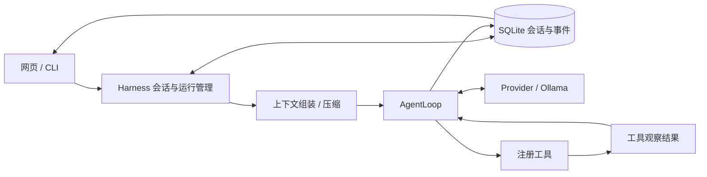

# Harness 实施计划：华小牛本地实验助手

版本：2026-10-08。依据：面试 PDF 第 3 页“参考 pi agent 的架构，搭建自己的 Harness”。本文是可执行计划；各阶段通过验收后才计为完成。自动科研是题目中的参考案例，本项目选择与现有大模型、YOLO 训练成果直接相关的实验助手。

## 目标与完成标准

用户输入：“读取这次训练的指标，检测这张示例图，说明结果的局限，再帮我记录实验笔记。”助手执行已注册工具，网页显示每一步的状态、结果和证据。重启服务后可以恢复会话；运行中断后能辨别哪些工具已经完成；长会话可以压缩上下文。

Harness 是管理模型、工具和任务运行的外层：模型决定下一步调用，工具提供真实结果，Harness 管理会话、事件、预算、存储与恢复。系统提示词和一个历史列表只实现其中很小一部分。

当前已具备：Ollama provider、最多五轮工具调用/十次调用、近期文本历史预算、工具参数校验、CLI、Web、YOLO 训练和推理、真实训练证据。当前 `core/harness.py` 仍是内存会话原型，没有独立事件层、持久化、取消、任务恢复或上下文摘要。这里写下的阶段均为待实施。

## 架构参考

Pi 官方仓库原地址 `badlogic/pi-mono` 现重定向到 `earendil-works/pi`。参考固定到已核对提交 `1cedd32724abfcb0915f76cc61b6827e2c16dbad`，后续升级需要重新核对接口。

| Pi 对应层 | 本项目模块 | 职责 |
| --- | --- | --- |
| pi-ai | `src/agent/core/provider.py` | 模型请求、结构化回复、流式输出、超时及能力检查 |
| pi-agent-core | `agent_loop.py`、`events.py`、`tools/` | 模型 → 工具 → 观察 → 下一轮，校验和预算 |
| AgentSession / SessionManager | `harness.py`、`session_store.py`、`context.py` | 会话、运行状态、保存、恢复和上下文压缩 |
| CLI / SDK / RPC 展示层 | Harness CLI、`harness_routes.py`、新实验助手页 | 调用同一 Harness，展示真实执行过程 |

Pi Agent 区分应用上下文处理与转换成模型消息；会话、持久化和压缩由外层承担。本项目用 Python 参考这种分层，保留现有 FastAPI/Ollama 技术栈。[官方 Agent 说明](https://github.com/earendil-works/pi/blob/1cedd32724abfcb0915f76cc61b6827e2c16dbad/packages/agent/README.md)、[AgentSession 源代码](https://github.com/earendil-works/pi/blob/1cedd32724abfcb0915f76cc61b6827e2c16dbad/packages/coding-agent/src/core/agent-session.ts)。

预期调用链：网页/CLI → Harness → 组装会话上下文 → AgentLoop → Provider → 工具执行 → 保存事件/观察结果 → 下一轮 → 最终回复。文字冒险保留现有独立入口，实验助手与游戏各自管理会话。

## 阶段 1：事件与执行核心

交付 `provider.py`、`agent_loop.py`、`events.py` 和工具执行接口。先迁移已有逻辑，再加入事件，保持现有 `chat()` 可用。工具顺序执行，避免先引入并发造成副作用和 GPU 争用。

自定义事件至少含 `run_start`、`turn_start`、`model_end`、`tool_start`、`tool_end`、`run_end`。每个事件包含 `session_id`、`run_id`、递增 `seq`、时间、状态；工具事件另含 `call_id`、工具名称、经过校验的输入、输出、耗时和错误。事件名称为本项目协议，不声称与 Pi 格式兼容。记录实际工具过程与最终答案。

验收：

- [ ] “查时间 → 计算 → 记笔记”完成真实工具调用，界面轨迹与实际执行一致。
- [ ] 非法参数、未知工具、工具异常、模型空回复和接口格式错误有结构化失败结果。
- [ ] 超过五轮/十次调用时终止；每次模型请求的等待不超过剩余时间预算。
- [ ] 离线模拟回复测试通过，再用真实 qwen2.5:7b 验证工具选择；分别保存证据。

## 阶段 2：会话持久化

交付 `session_store.py`，使用 Python 内置 SQLite，数据落在被 Git 忽略的 `logs/harness.sqlite3`。建议表：`sessions`、`runs`、`messages`、`tool_calls`、`events`。使用事务保存一个已完成步骤和对应观察结果，`call_id` 对运行唯一；同一会话同时只允许一个运行者。

保存模型原始 assistant 工具调用及其完整 tool results，恢复上下文时保持成组关系。提供新建、恢复、重置、删除会话和自定义 JSONL 导出。笔记按会话或用户隔离。Pi 原生会话使用 JSONL 与父子关系；本项目先采用线性会话，树状分支作为后续扩展。[官方会话格式](https://github.com/earendil-works/pi/blob/1cedd32724abfcb0915f76cc61b6827e2c16dbad/packages/coding-agent/docs/session-format.md)。

验收：

- [ ] 关闭并重启服务后，恢复会话可继续此前任务。
- [ ] 两个会话消息和笔记互不串用；同会话并发提交返回明确的忙碌状态。
- [ ] 恢复的模型上下文包含真实工具过程，导出文件可被测试重新读取。
- [ ] 数据库写入失败不报成功，原历史仍可读取。

## 阶段 3：网页观测与取消

交付 `harness_routes.py` 和实验助手页。建议接口：

| 接口 | 用途 |
| --- | --- |
| `POST /api/harness/sessions` | 新建会话 |
| `POST /api/harness/sessions/{id}/runs` | 提交任务，立即返回 `run_id` |
| `GET /api/harness/runs/{id}` | 读取当前状态、结果或失败原因 |
| `GET /api/harness/runs/{id}/events?after_seq=N` | 从序号之后读取事件，支持重连 |
| `POST /api/harness/runs/{id}/cancel` | 请求取消 |
| `GET /api/harness/sessions/{id}/export` | 导出会话记录 |

第一版用增量轮询即可验收，再按实际需要加 SSE。迁移到 `httpx.AsyncClient` 后支持取消正在等待的模型请求；同步 YOLO 计算先在执行边界响应取消，页面明确显示“正在结束当前步骤”。状态为 `queued/running/completed/failed/cancelled/interrupted`，所有结束状态均可再次提交。

验收：

- [ ] 执行中能看到真实工具卡片，页面刷新/断线重连只读事件，不重新提交工具。
- [ ] 请求取消后没有新的工具启动；取消和超时有结束事件。
- [ ] Ollama 断开时出现可理解提示，输入框恢复可操作状态。
- [ ] 同一个 `run_id` 的事件顺序稳定，重复轮询不导致重复卡片。

## 阶段 4：接入专业工具

复用现有训练文件和 YOLO，不另建训练平台。

| 工具 | 输入和输出 | 文件边界 |
| --- | --- | --- |
| `read_training_result` | 返回参数、P/R、mAP、样本数、文件版本和证据路径 | 只读本项目训练证据目录 |
| `detect_image` | 输入 `image_id`；返回尺寸、类别、置信度、框坐标、权重哈希和标注图 ID | 图片上传接口校验后分配 ID，模型不能指定任意本地路径 |
| `save_experiment_note` | 输入内容；输出笔记 ID 和保存状态 | SQLite 按会话保存，使用 call_id 防重复写入 |

图片上传限制字节数、像素数及允许格式，解码成功后才进入工具。YOLO 产生结构化视觉结果，语言模型负责解释；当前 qwen2.5:7b 是文本模型，不能声称直接看懂图片。[Ollama 模型信息](https://ollama.com/library/qwen2.5)。YOLO 与 Ollama 使用同一显卡时顺序运行并记录延迟，根据实测决定是否切换 CPU。

验收：

- [ ] 一次任务完成“读指标 → 检测公开示例图 → 总结局限 → 存笔记”。
- [ ] 模型引用的指标与训练 JSON/CSV 一致，框坐标与标注图一致。
- [ ] 没有检测到目标时如实返回空列表；缺失或损坏权重不会伪造检测结果。
- [ ] 任意路径、非法图片或过大图片在工具执行前被拒绝。

完成阶段 1–4 且综合演示通过后，可称“可演示的实验助手 Harness”。

## 阶段 5：任务恢复与上下文压缩

保存已完成步骤、待做步骤、tool call 状态和工具结果。恢复规则：已成功工具复用结果；只读工具可安全重试；副作用工具若结果未知，先核查保存状态，再决定是否执行。笔记保存与幂等标记使用同一事务。参考 Pi 对工具结果及错误的类型边界，恢复规则需在本项目自行实现。[官方工具类型](https://github.com/earendil-works/pi/blob/1cedd32724abfcb0915f76cc61b6827e2c16dbad/packages/agent/src/types.ts)。

压缩输出结构化摘要：任务目标、关键事实/指标、证据 ID、完成步骤、待做步骤、当前约束。保留近期完整轮次，assistant 工具调用与全部 tool results 不能被拆开。原历史永久保留，摘要仅作为后续模型请求的上下文投影；手动和阈值触发使用同一流程。[官方压缩说明](https://github.com/earendil-works/pi/blob/1cedd32724abfcb0915f76cc61b6827e2c16dbad/packages/coding-agent/docs/compaction.md)。

验收：

- [ ] 模拟“工具完成、最终回复前”退出，恢复时不重复写笔记。
- [ ] 恢复日志能说明继续了什么、复用了什么、哪些步骤仍未确定。
- [ ] 长会话压缩后仍保留训练指标、证据路径、任务目标和待做项。
- [ ] 摘要生成失败不替换原历史，用户可以重试压缩。

## 阶段 6：演示与回归证据

交付架构图、接口说明、脱敏执行轨迹、综合演示脚本和面试说明，更新 README 的完成情况。

- [ ] 离线确定性检查覆盖错误、预算、隔离、持久化、取消、恢复和压缩。
- [ ] 真实 Ollama 的多工具综合任务通过，单独记录模型是否稳定完成。
- [ ] 静态公开图片 YOLO 检测通过；摄像头现场验证作为另一个验收项。
- [ ] 每项完成状态都能链接到代码、测试或真实演示证据。

## 推进顺序与风险处理

顺序为 1 → 2 → 3；阶段 4 可在存储接口稳定后与网页并行；2 + 4 完成后做 5，最后做 6。每阶段单独提交，保持已有游戏和检测入口可运行。预计需要多轮实现和联调，按实际验收推进，本文不承诺尚未验证的交付时间。

| 风险 | 处理方式 |
| --- | --- |
| 小模型多步工具选择不稳定 | 工具 schema 精简；确定性执行测试与真实模型测试分别记录 |
| 模型与 YOLO 争用 8GB 显存 | 首版顺序执行；记录显存/延迟后再选择设备 |
| 训练样例过小 | 保留 coco8 样本数与局限说明，指标仅证明流程可复现 |
| 摄像头画面全黑 | 先验收公开样例图；实物隐私开关与遮挡由现场确认 |
| 写入后中断造成重复副作用 | SQLite 事务、call_id 幂等标记、恢复时核查执行状态 |
| 计划继续膨胀 | 第一版只做指标读取、图片检测和实验笔记；每个新增工具须对应一个验收任务 |

硬件点灯/PID 另需开发板、连接方式和真实设备验证；科研论文自动发表等任务也有独立依赖。它们不作为本 Harness 六个阶段的隐含交付。
