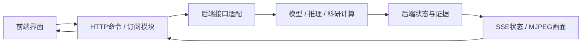

# 按面试要求整理后的模块结构

日期：2026-10-10。以用户补充的六条工程要求为本轮依据。

| 要求 | 实现位置 |
| --- | --- |
| 按功能封装 | src/agent、src/yolo、src/web、src/research，README说明入口与边界 |
| 主程序只组装 | web/main.py组装FastAPI/资源/路由；agent/cli.py组装模型与控制台 |
| 顶部简注 | 活跃Python模块有docstring；JS/CSS/HTML及启停脚本有职责说明，历史原件保持原样 |
| 前后端解耦 | static中的UI通过transport提交指令/订阅SSE或MJPEG；模型、推理、测量、账本在后端 |
| 根README有启动命令 | README开头给start/stop及首次安装，细节放各模块 |
| 功能目录有短README | src及功能子目录、scripts、configs、tests、assets、evidence、archive均有说明 |

## 面试分类

1. **基础任务**：agent为本地模型/智能体，yolo为训练与推理，web将两者接到应用。
2. **创意作品**：文字冒险使用chat_service复用本地智能体。
3. **进阶Harness**：research提供固定科研任务、持久执行、证据与写作；期刊资料/咨询草稿为额外探索，未发送。
4. **硬件**：本人确认已完成，按实际项目演示，没有虚构控制代码。
5. **工程资料**：docs保留说明与日志，docs/evidence为训练归档，根evidence为科研摘要，logs/runs为忽略Git的原始运行。
6. **历史归档**：原exam1、exam2与未使用的内存Harness移入archive/legacy，源码与截图保留，不参与启动。

## 依赖与数据方向

生命周期服务统一启动科研并释放资源，健康接口独立。订阅不启动研究或打开摄像头，断开只释放订阅；共享检测由显式停止或应用退出释放。科研SSE首帧为快照，后续为变化字段和新增事件，带游标/心跳；视觉SSE推送后端计算的状态/用时。无EventSource环境由传输模块兼容查询，正常浏览器使用订阅。

前端格式化百分比、时间和文件大小，不重新计算实验结论。回归记录在verification.md；浏览器视觉与真实云端调用仍按独立证据标记。
